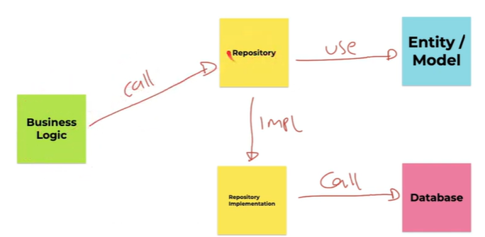

# PHP MySQL

## 1. Pengenalan PDO (PHP Data Object)

A. PDO adalah spesifikasi interface untuk koneksi PHP dengan Database.

B. PDO menyediakan _abstraction layer_ yang fleksible untuk semua jenis database, yang artinya bisa menggunakan PDO yang sama.

C. Cara kerja PDO


D. Cek PDO Exstension PDO yang ter-install

    ```PHP
    <?php

    phpinfo();
    ```

---

### 1. Koneksi ke Database

- Buat Database

  

- Koneksi ke Database

  ```PHP
  <?php

  $host = "localhost";
  $port = 3306;
  $database = "belajar_php_database";
  $username = "root";
  $password = "";

  $connection = new PDO("mysql:host=$host:$port;dbname=$database", $username, $password);

  echo "Sukses terkoneksi ke database MySQL" . PHP_EOL;
  ```

- Error PDOExeception

  - Gunakan perintah `try catch` untuk melakukan sesuatu jika komunikasi _error_ ke database.

  ```PHP
  try {
  $connection = new PDO("mysql:host=$host:$port;dbname=$database", $username, $password);
  echo "Sukses terkoneksi ke database MySQL" . PHP_EOL;

  }catch (PDOException $exception){
      echo "Gagal terkoneksi ke database MySQL : " . $exception->getMessage() . PHP_EOL;
  }
  ```

- Menutup Koneksi

  - MySQL secara default memiliki batas maksimal koneksi sebanyak 151 kali.

  - Kita wajib menutup koneksi ke database jika sudah selesai melakukan operasi ke database.

  ```PHP
    $connection = null;
  ```

---

### 2. Execute SQL

- Untuk mengirim data ke SQL kita bisa menggunakan perintah `execute(sql)`.

  ```PHP
  function getConnection(): PDO
  {
      $host = "localhost";
      $port = 3306;
      $database = "belajar_php_database";
      $username = "root";
      $password = "";

      return new PDO("mysql:host=$host:$port;dbname=$database", $username, $password);
  }
  ```

- Membuat Table

  

- Execute SQL menggunakan PDO

  ```PHP
  require_once __DIR__ . '/GetConnection.php';

  $connection = getConnection();

  $sql = <<<SQL
      INSERT INTO customers(id, name, email)
      VALUES ('Elaina', 'Elaina', 'elaina@test.com');
  SQL;

  $connection->exec($sql);

  $connection = null;
  ```

- Hasil `INSERT` akan dimasukan ke dalam table `customers`.

  

---

### 3. Query SQL

- PDO memiliki _function_ `Query SQL`, yang digunakan untuk melakukan `query` dari data ke database.

- Return dari _function_ `Query SQL` adalah objek dari PDOStatement.

  ```PHP
  require_once __DIR__ . '/GetConnection.php';

  $connection = getConnection();

  $sql = "SELECT id, name, email FROM customers";
  $statement = $connection->query($sql);

  $connection = null;
  ```

- PDOStatement adalah turunan _class_ dari operator `iteratorAggregate`, dan secara otomatis operator ini bisa meggunakan perulangan `foreach`.

  ```PHP
  foreach ($statement as $row) {
  $id = $row["id"];
  $name = $row["name"];
  $email = $row["email"];

  echo "Id : $id" . PHP_EOL;
  echo "Name : $name" . PHP_EOL;
  echo "Email : $email" . PHP_EOL;
  }
  ```

---

### 4. SQL Injection

- Membuat Table Admin

  

- SQL Injection adalah teknik yang menyalahgunakan celah keamanan didalam lapis basis data atau aplikasi.

- Contoh kode `sql injection`

  ```PHP
  $username = "admin'; #";
  $password = "admin";
  ```

- `#` didalam `sql` berarti komentar yang artinya tidak di eksekusi oleh `MySQL` dan ini memungkinkan ada yang masuk aplikasi tanpa login yang benar.

- Solusinya

  1. Bisa menggunakan _function_ `query()` dan `execute()` jika tidak membutuhkan _parameter_ dari user.

  2. Jika membutuhkan _parameter_ dari user bisa menggunakan _function_ `prepare(sql)`.

  3. Atau bisa juga memastikan input user aman menggunakan `quote()`.

  ```PHP
  $username = $connection->quote("admin'; #");
  $username = $connection->quote("salah ga peduli");

    $sql = "SELECT * FROM admin WHERE username = $username AND password = $password;";
  ```

---

### 5. Prepare Statement

- Menggunakan _function_ `prepare()` adalah cara aman untuk membuat `SQL` dengan input dari user.

  ```PHP
  require_once __DIR__ . '/GetConnection.php';

  $connection = getConnection();

  $sql = "SELECT * FROM admin WHERE username = :username AND password = :password";
  $statement = $connection->prepare($sql);

  $connection = null;
  ```

- Binding Parameter

  - Secara otomatis , semua input user akan di `quote` oleh `prepare statement`, jadi kita tidak perlu melakukan `quote` secara manual.

  ```PHP
  require_once __DIR__ . '/GetConnection.php';

  $connection = getConnection();

  $username = "admin'; #";
  $password = "admin";

  $sql = "SELECT * FROM admin WHERE username = :username AND password = :password";
  $statement = $connection->prepare($sql);
  $statement->bindParam("username", $username);
  $statement->bindParam("password", $password);
  $statement->execute();

  $success = false;
  $find_user = null;
  foreach ($statement as $row) {
      // sukses
      $success = true;
      $find_user = $row["username"];
  }

  if ($success) {
      echo "Sukses login : " . $find_user . PHP_EOL;
  } else {
      echo "Gagal login" . PHP_EOL;
  }

  $connection = null;
  ```

- Binding Parameter dengan Index

  - Untuk melakukan `binding parameter` bisa juga menggunakan `index`(angka).

  - Cukup dengan mengganti `:namaparameter` dengan `?`.

  - Lalu gunakan nomor `index` saat melakukan `binding parameter`.

  ```PHP
  $sql = "SELECT * FROM admin WHERE username = ? AND password = ?";
  $statement = $connection->prepare($sql);
  $statement->bindParam(1, $username);
  $statement->bindParam(2, $password);
  $statement->execute();
  ```

- Parameter Index tanpa Bind

  ```PHP
  $sql = "SELECT * FROM admin WHERE username = ? AND password = ?";
  $statement = $connection->prepare($sql);
  $statement->execute([$username, $password]);
  ```

- Binding Parameter non Query

  ```PHP
  require_once __DIR__ . '/GetConnection.php';

  $connection = getConnection();

  $username = "Kiana";
  $password = "rahasia";

  $sql = "INSERT INTO admin(username, password) VALUES (:username, :password)";
  $statement = $connection->prepare($sql);
  $statement->bindParam("username", $username);
  $statement->bindParam("password", $password);
  $statement->execute();

  $connection = null;
  ```

---

### 6. Fecth Data

- _Function_ `fecth()` pada PDO digunakan untuk mengambil satu data dari hasil query tanpa perlu melakukan iterasi manual.

- Penggunaan `fetch()` secara langsung bisa membuat kode lebih sederhana dan efisien daripada melakukan iterasi manual dalam mengambil data dari hasil query.

- Jika ingin mengambil semua data dari hasil query, bisa menggunakan `fetchAll()` untuk langsung mengonversi hasil query menjadi array tanpa perlu persiapan parameter.

  ```PHP
  $connection = getConnection();

  $sql = "SELECT * FROM admin WHERE username = :username AND password = :password";
  $statement = $connection->prepare($sql);
  $statement->bindParam("username", $username);
  $statement->bindParam("password", $password);
  $statement->execute();

  if ($row = $statement->fetch()) {
    echo "Sukses Login : " . $row["username"] . PHP_EOL;
  } else {
    echo "Gagal Login" . PHP_EOL;
  }

  $connection = null;
  ```

- _Function_ `fetchAll()`

  ```PHP

  $connection = getConnection();

  $sql = "SELECT * FROM customers";
  $statement = $connection->query($sql);

  $customers = $statement->fetchAll();
  var_dump($customers);

  $connection = null;
  ```

---

### 7. Auto Incremet

- `Autoincrement` digunakan untuk membuat ID yang naik secara otomatis. _Function_ `lastInsertId()` dapat digunakan untuk mengambil ID terakhir yang di-generate secara otomatis.

- Membuat Table Comment

  

  ```PHP
  require_once __DIR__ . '/GetConnection.php';

  $connection = getConnection();

  $connection->exec("INSERT INTO comments(email, comment) VALUES ('gusti@test.com', 'hi')");
  $id = $connection->lastInsertId();

  echo $id . PHP_EOL;

  $connection = null;
  ```

---

### 8. Database Transaction

- Untuk melakukan transaksi di PDO bisa menggunakan _function_ `beginTransaction()`.

- Dan untuk commit transaksi bisa menggunakan _function_ `commit()`.

- Sedangkan untuk melakukan rollback bisa menggunakan _function_ `rollBack()`.

  ```PHP
  require_once __DIR__ . '/GetConnection.php';

  $connection = getConnection();

  $connection->beginTransaction();

  $connection->exec("INSERT INTO comments(email, comment) VALUES ('gusti@test.com', 'hi')");
  $connection->exec("INSERT INTO comments(email, comment) VALUES ('gusti@test.com', 'hi')");
  $connection->exec("INSERT INTO comments(email, comment) VALUES ('gusti@test.com', 'hi')");

  $connection->commit();

  $connection = null;
  ```

- Transaktion `rollBack`

  ```PHP
  $connection = getConnection();

  $connection->beginTransaction();

  $connection->exec("INSERT INTO comments(email, comment) VALUES ('kiana@test.com', 'hi')");
  $connection->exec("INSERT INTO comments(email, comment) VALUES ('kiana@test.com', 'hi')");
  $connection->exec("INSERT INTO comments(email, comment) VALUES ('kiana@test.com', 'hi')");

  $connection->rollBack();

  $connection = null;
  ```

---

### 9. Repository Pattern

- `Pattern Repository` adalah mekanisme untuk mengelola akses dan manipulasi data dalam aplikasi, yang memisahkan logika bisnis dari akses database. Implementasi repository membantu dalam pengelolaan koneksi dan operasi database.

- Diagram `Pattern Repository`

  

- Entity atau Model

  - Dalam pengembangan aplikasi berbasis objek, tabel database biasanya direpresentasikan sebagai kelas model atau entity. Hal ini mempermudah dalam pengembangan dan pemeliharaan kode program dengan memisahkan logika bisnis dari akses database.

  

- Repository

  ```PHP
  namespace Repository {

      use Model\Comment;

      interface CommentRepository
      {

          function insert(Comment $comment): Comment;

          function findById(int $id): ?Comment;

          function findAll(): array;

      }

      class CommentRepositoryImpl implements CommentRepository
      {

          public function __construct(private \PDO $connection)
          {
          }

          public function insert(Comment $comment): Comment
          {
              $sql = "INSERT INTO comments(email, comment) VALUES (?, ?)";
              $statement = $this->connection->prepare($sql);
              $statement->execute([$comment->getEmail(), $comment->getComment()]);

              $id = $this->connection->lastInsertId();
              $comment->setId($id);

              return $comment;
          }

          public function findById(int $id): ?Comment
          {
              $sql = "SELECT * FROM comments WHERE id = ?";
              $statement = $this->connection->prepare($sql);
              $statement->execute([$id]);

              if ($row = $statement->fetch()) {
                  return new Comment(
                      id: $row["id"],
                      email: $row["email"],
                      comment: $row["comment"]
                  );
              } else {
                  return null;
              }
          }

          public function findAll(): array
          {
              $sql = "SELECT * FROM comments";
              $statement = $this->connection->query($sql);

              $array = [];

              while ($row = $statement->fetch()) {
                  $array[] = new Comment(
                      id: $row["id"],
                      email: $row["email"],
                      comment: $row["comment"]
                  );
              }

              return $array;
          }

      }

  }

  ```

- Test Repository

  ```PHP
  require_once __DIR__ . '/GetConnection.php';
  require_once __DIR__ . '/Model/Comment.php';
  require_once __DIR__ . '/Repository/CommentRepository.php';

  use Repository\CommentRepositoryImpl;
  use Model\Comment;

  $connection = getConnection();
  $repository = new CommentRepositoryImpl($connection);

  $comment = new Comment(email: "repository@test.com", comment: "Hi");
  $newComment = $repository->insert($comment);

  var_dump($newComment->getId());

  $comment = $repository->findById(32);
  var_dump($comment);

  $comments = $repository->findAll();
  var_dump($comments);

  $connection = null;
  ```

---

## 2. Pertanyaan & Catatan Tambahan

- Saya menggunakan text editor yang berbeda dari yang ada dividio, dan saya juga membuat database secara manual menggunakan `cmd`.

---

## 3. kesimpulan

- Menggunaka MySQL dalam pengebangan perangkat lunak menggunakan bisa menjadi pilihan bagi para programmer pemula seperti saya.
